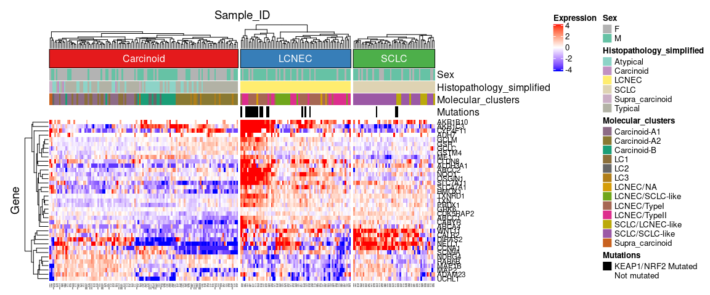

## Hamad et al. 2021 (in preparation)

This repository contains `R` code to generate some of the figures
presented in Hamad *et al.* 2021 (*in preparation*).

We used publicly available RNA-seq data and mutations in human tumors to
demonstrate that the NRF2 pathway is expressed at higher levels in
tumors carrying KEAP1/NRF2 mutations.

Human tumor RNA-seq data was obtained from [this
repository](https://github.com/IARCbioinfo/DRMetrics) and processed here
consistent with [this
meta-analysis](https://nextjournal.com/rarecancersgenomics/a-molecular-map-of-lung-neuroendocrine-neoplasms/)

We then annotate each tumor based on mutation profiles published in
Supplementary materials of each individual study (Alcala 2019, Fernandez
2014, George 2015, George 2018, Laddha 2019,and Peifer 2012), Sup Data
Tables 4, 1, 3, 6, 2, and 9, respectively.

We then use
[tidyHeatmap](https://cran.r-project.org/web/packages/tidyHeatmap/index.html)
to plot a VST-normalized, median-centered heatmap with tumor subtype,
sex, histopathology, molecular subtype, and KEAP1/NRF2 mutations
annotated.

## Load packages

``` 
library(vctrs)
library(rsample)
library(stringr)
library(tidyverse)
library(magrittr)
library(BiocGenerics)
library(S4Vectors)
library(IRanges)
library(GenomeInfoDb)
library(GenomicRanges)
library(Biobase)
library(matrixStats)
library(BiocParallel)
library(DelayedArray)
library(SummarizedExperiment)
library(DESeq2)
library(ComplexHeatmap)
library(tidyHeatmap)
library(circlize)
library(rematch)
library(readxl)

```

## Read in human data

In this directory I git cloned [this
repo](https://github.com/IARCbioinfo/DRMetrics) The following steps
recapitulate what was described \[in this meta-analysis\]
(<https://nextjournal.com/rarecancersgenomics/a-molecular-map-of-lung-neuroendocrine-neoplasms/>)

``` r
Attributes = read.table(unzip('Attributes.txt.zip')[1], sep = '\t', header = T)
Attributes[1:5,1:10]
```

    ##   Sample_ID Histopathology Age Sex Smoking_status Survival_months Histopathology_simplified Molecular_clusters
    ## 1   LNEN002       Atypical  49   M          Never           287.7                  Atypical        Carcinoid-B
    ## 2   LNEN003       Atypical  17   M          Never           100.0                  Atypical       Carcinoid-A2
    ## 3   LNEN004       Atypical  18   M        Current           163.2                  Atypical       Carcinoid-A2
    ## 4   LNEN005       Atypical  80   M         Former           144.6           Supra_carcinoid    Supra_carcinoid
    ## 5   LNEN006       Atypical  58   F          Never           166.3                  Atypical       Carcinoid-A2
    ##   Histopathology_MachineLearning_prediction    HOXC8
    ## 1                                   Typical 3.179271
    ## 2                                   Typical 3.965615
    ## 3                                   Typical 4.813331
    ## 4                                     LCNEC 3.930598
    ## 5                                   Typical 2.796746

``` r
read_counts = as.matrix(read.table(unzip('read_counts_all.txt.zip')[1], header = T, row.names=1))
read_counts[1:5,1:10]
```

    ##                    LNEN002 LNEN003 LNEN004 LNEN005 LNEN006 LNEN007 LNEN008 LNEN009 LNEN010 LNEN011
    ## ENSG00000000003.15    1168      91      96     241     166     207     196     184      52     130
    ## ENSG00000000005.6        0       0       0       0       0      33       0       0      45      22
    ## ENSG00000000419.12     438     607     802     941     519     645     386    1157     539     702
    ## ENSG00000000457.14    1531    1385    1754    1682    1214     924     786     734    2486    1551
    ## ENSG00000000460.17      53      83      53     193      64      51      62     137     113     110

``` r
# Read gene annotations 
genespans   = read.table(unzip('ref_annot.gtf.gene_spans.zip')[1],stringsAsFactors = F)
dim(genespans)
```

    ## [1] 59607     7

``` r
rownames(genespans) = genespans[,1]
```

## Next, remove genes on sex and mitochondrial chromosomes, then VST-normalize using DESeq2

``` r
genenames   = rownames(read_counts)
summary(genenames %in% rownames(genespans))
```

    ##    Mode    TRUE 
    ## logical   59607

``` r
genes.sex   = genespans[genespans$V2 %in% c("chrM", "chrX", "chrY"), ]
genes.nosex = genespans[!(genespans$V2 %in% c("chrM", "chrX", "chrY")), ]

read_counts = read_counts[which(rownames(read_counts) %in% rownames(genes.nosex)), ]
dim(read_counts)
```

    ## [1] 56597   239

``` r
colData = as.matrix(colnames(read_counts))
DESeq_object = DESeqDataSetFromMatrix(countData=read_counts,colData = colData,design = ~1)
VST = varianceStabilizingTransformation(DESeq_object)
VST = assay(VST)
dim(VST)
```

    ## [1] 56597   239

``` r
VST[1:5,1:5]
```

    ##                      LNEN002   LNEN003   LNEN004   LNEN005   LNEN006
    ## ENSG00000000419.12  9.283071  9.316601  9.700661  9.893787  9.292338
    ## ENSG00000000457.14 11.079050 10.499429 10.824238 10.727867 10.510744
    ## ENSG00000000460.17  6.327856  6.524458  5.912062  7.641256  6.361985
    ## ENSG00000000938.13  5.663186  6.491421  7.719420  8.767549  8.122273
    ## ENSG00000000971.16  9.904494  9.462115  9.329925 11.886873  9.952627

## Reduce to one replicate per individual

``` r
vst.reduced = VST[,as.character(Attributes$Sample_ID)]
dim(vst.reduced)
```

    ## [1] 56597   238

## Tidy attributes table

``` r
annot = as_tibble(Attributes) %>% 
    select(Sample_ID,Sex,Histopathology_simplified,Molecular_clusters,Survival_months) %>%
    mutate(Survival = replace_na(Survival_months,300)) %>%
    mutate(Sample_ID = as.character(Sample_ID)) %>%
    select(!Survival_months) %>%
    mutate(
        Subtype = case_when(
            Histopathology_simplified == "Typical" ~ "Carcinoid",
            Histopathology_simplified == "Atypical" ~ "Carcinoid",
            Histopathology_simplified == "Carcinoid" ~ "Carcinoid",
            Histopathology_simplified == "Supra_carcinoid" ~ "Carcinoid",
            Histopathology_simplified == "LCNEC" ~ "LCNEC",
            Histopathology_simplified == "SCLC" ~ "SCLC",
            T ~ "Other"
            )
        )
    
all(annot$Sample_ID == colnames(vst.reduced))
```

    ## [1] TRUE

## Median center VST values across all samples

``` r
medianCtr<-function(x){
    annAll <- dimnames(x)
    medians <- apply(x,1,median,na.rm=T)
    x <- t(scale(t(x),center=medians,scale=F))
    dimnames(x) <- annAll
    return(x)
}

vst.ctr = medianCtr(vst.reduced)
```

## Convert ENSG to gene symbols

``` r
hgnc.lookup = read.table("GENCODE_hg38_v33_lookup_uniq.txt",header=F,sep="\t",row.names=1)
sym.hgnc = as.character(hgnc.lookup[rownames(vst.ctr),1])
vst.hgnc = cbind(sym.hgnc,as.data.frame(vst.ctr))

# Remove a few duplicated genes, ie 2+ ENSG mapped to one gene symbol
vst.hgnc.uniq = as_tibble(vst.hgnc) %>% 
    drop_na(sym.hgnc) %>% 
    distinct(sym.hgnc,.keep_all=TRUE)
```

## Construct list of NRF2 target genes, based on Singh and NRF2-ACT

``` r
# Singh NRF2/NFE2L2 genes
nrf2 = c("GRK6","ABCC1","PRDX1","TXNRD1","GCLC","ME1","ABCC2","HMOX1","GCLM","NQO1","GSR","GSTM4","G6PD","TXN")

NRF2ACT = c("AKR1C3","AKR1B10","ALDH3A1","ADH7","SLC47A1","NDRG4","TSPAN7","ADAM23","MAP1B","SCN9A","RAB6B","LPPR1","NQO1","SLC7A11","UCHL1","MAP2","NR0B1","CABYR","CDK5RAP2","OSGIN1","CYP4F11","DIRAS2","CLDN8","ABCA4","CCNA1","CALB2","NELL1","WNT11")
nrf2_combined = unique(c(nrf2,NRF2ACT))
```

## Filter for NRF2 target genes

``` r
vst.hgnc.nrf2 = vst.hgnc.uniq %>%
    filter(sym.hgnc %in% nrf2_combined) %>%
    pivot_longer(cols = !starts_with("sym"),names_to="Sample_ID",values_to="Expression") %>%
    rename(sym.hgnc = "Gene") %>%
    mutate(Gene = as.character(Gene))
```

## Bring in mutation data

``` r
joined = inner_join(vst.hgnc.nrf2,annot,by="Sample_ID")

alcala2019 = read_excel("Alcala2019_SupData4_mutTable.xlsx") %>%
    select(SampleID,Gene) %>%
    add_column(Study = "Alcala2019")

fernandez2014 = read_excel("Fernandez2014_SupData1_mutTable.xlsx") %>%
    select(SampleID,Gene) %>%
    add_column(Study = "Fernandez2014")


george2015 = read_excel("George2015_SupTable3_mutTable.xlsx",range=c("A1:C38647")) %>%
    select(SampleID,Gene) %>%
    add_column(Study = "George2015")


george2018 = read_excel("George2018_SupData6_mutTable.xlsx") %>%
    select(SampleID,Gene) %>%
    add_column(Study = "George2018")


laddha2019 = read_excel("Laddha2019_SupFile2_mutTable.xlsx") %>%
    select(SampleID,Gene) %>%
    add_column(Study = "Laddha2019")


peifer2012 = read_excel("Peifer2012_SupTable9_mutTable.xlsx") %>%
    select(SampleID,Gene) %>%
    add_column(Study = "Peifer2012")

# A few notes on these tumor annotations

# Note on Laddha
# Targeted capture sequencing for specific genes/mutated positions
# KEAP1, NFE2L2 represented in MSK-IMPACT panel (see PMID 25801821 Sup Table S1 for info)
# All others either observed KEAP1/NRF2 mutations or did WGS/WES and in theory could have detected them

# There are several discrepancies where Alcala2019 uses a George2018 tumor (S01533, S01586, S02258), but the genotypes are different. 

# For S01533 and S01586, George calls it as KEAP1 mutant, but Alcala does not

# For S02258, George calls it as NFE2L2 mutant, but Alcala does not
```

## Bring mutation annotation together with gene expression data and plot

``` r
metamuts = bind_rows(alcala2019,fernandez2014,george2015,george2018,laddha2019,peifer2012) %>%
    select(!Study)

metamuts_kn = metamuts %>%
    filter(Gene=="KEAP1" | Gene=="NFE2L2")


mutannot = metamuts_kn %>% 
    unique() %>%
    group_by(SampleID) %>% 
    mutate(key = paste0('row', row_number())) %>% 
    pivot_wider(names_from=key,values_from=Gene) %>%
    unite("Muts", c(row1,row2),sep=",",na.rm=T) %>%
    rename(SampleID = "Sample_ID")

left_join(joined,mutannot) %>%
    mutate(Muts = replace_na(Muts,"None")) %>%
    mutate(
        Mutations = case_when(
            Muts == "None" ~ "Not mutated",
            Muts == "KEAP1" ~ "KEAP1/NRF2 Mutated",
            Muts == "NFE2L2" ~ "KEAP1/NRF2 Mutated",
            Muts == "KEAP1,NFE2L2" ~ "KEAP1/NRF2 Mutated",
            T ~ "Other")
    ) %>%
    group_by(Subtype) %>%
    tidyHeatmap::heatmap(Gene,Sample_ID,Expression,.scale="none",palette_value=colorRamp2(c(-4, 0, 4), c("blue", "white", "red"))) %>%
    add_tile(Sex) %>%
    add_tile(Histopathology_simplified) %>%
    add_tile(Molecular_clusters) %>%
    add_tile(Mutations,palette=c("white","black"))
```

    ## Joining, by = "Sample_ID"

<!-- -->
